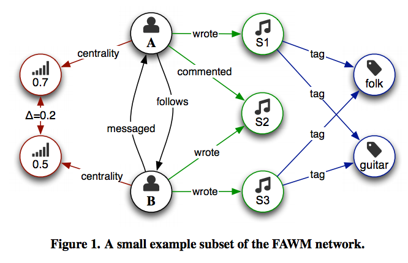

# Let's Get Together: The Formation and Success of Online Creative Collaborations

B. Settles, S. Dow.  [Let's Get Together: The Formation and Success of Online Creative Collaborations.](http://burrsettles.com/pub/settles.chi13.pdf) CHI 2013.

## tl;dr
 - Authors examined online creative songwriting community and pairwise patterns of collaboration.
 - Balance in community, effort, and status create successful collaborations.
 - Thought: can we reproduce these findings in other collaborative environments? What if it wasn't just two people? Is it the max or mean that is important?

## Overall Thoughts

Human computer interaction (HCI) is deceptively simple at first. Common concepts are formalized and then experimentally proven. On a personal level, this is my first HCI paper, so I was pleasantly surprised with how well the path-based logistic regression relates to [yesterday's health knowledge graph writeup](Halpern_ch5.md). Here we are more focused on predicting successful collaborations and what features (e.g. communication, complementary interests, etc) can help.

The paper explores four years of data from February Album Writing Month (FAWM) where pairs of collaborators work on a song together. Data is collected through a voluntary survey, and directional links between users can take multiple forms: liking, common genres of music, cowriting songs. Actual network edges were then calculated using [eigenvector centrality scores](https://en.wikipedia.org/wiki/Eigenvector_centrality). Edges between users are then sampled according to a random walk of length 4 and features are gathered for users who collaborated (positive examples) and users who did not (negative examples) and fitted to a predictive model. The method of eigenvector centrality, random sampling, and then LASSO regression was new to me since the path-based regression was more important than the degree = 1 exploration of the health knowledge graph. 

Findings of the paper included some intuitively correct phenomenon of what increases likelihood of collaboration: similar skill-level, similar effort levels, and frequent communication. My biggest question from the paper was, how can this be applicable to other communities? What about this is actionable in a way beyond allowing organic or rudimentarily suggested collaborations? 

As a HCI newbie, I also don't understand how this paper fits in with other HCI papers. That's a topic for another day though.

## Metholody
 - Given the entire graph of relations between users (liked each other's new feed, etc), authors calculated the [eigenvector centrality score](https://en.wikipedia.org/wiki/Eigenvector_centrality) of each node. Add edges between each pair of nodes that computes the difference between the centrality scores
 - With these new paths between nodes, use random walks (path length <= 4) to sample possible paths. Use logistic regression and LASSO to handle sparsity in the sample space and select only "meaningful" path edges. Calculate which path features predict collaboration.
 - This method is benchmarked against random walks without logistic regression, a model from Adamic & Adar to prevent co-authorship, and a matrix factorization method used in recommendation systems. The model featured outperforms these benchmarks.

## Findings
 - Communication exchanges best predict collaboration
 - Collaborations form out of common interests, small skill differences, and different skills
 - Higher status (aka higher centrality) collaborators enjoy the collaboration less