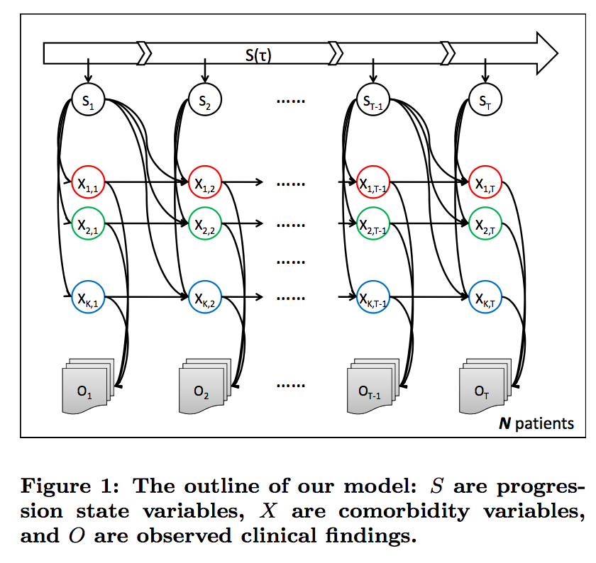

# Unsupervised Learning of Disease Progression Models

X. Wang, D. Sontag, F. Wang. [Unsupervised Learning of Disease Progression Models.](http://cs.nyu.edu/~dsontag/papers/WanSonWan_kdd14.pdf) ACM SIGKDD Conference on Knowledge Discovery and Data Mining (KDD), Aug. 2014.

## tl;dr
 - Paper proposes three-layer model that learns diease progression
 - Layers include Markov Jump Process (continuous disease state transitions), Markov Chain (comorbidities), and noisy-or Bayesian network (observed clinical evidence and comorbidities).

## Overall Thoughts
Honestly, I'm glad I picked this as a first paper for 2017, but what a theoretical mind-twister! Had to read several times to understand anything, and I imagine that'll continue.

The paper walks through a three-layered graphical model for disease progression, which comes down to identifying which parts of the model to abstract away and which parts to link together. After outlining the model, the rest of the paper describes how to estimate the continuous parameters using EM algorithm and Gibbs sampling. 

Lastly the authors describe empirical results using specific comorbidities and ICD-9 codes. Here each group looked more or less reasonable, but I would rely on the medical professionals to determine whether or not such a model would be useful.

## Section 1
 - Quick scan of main details: section titles, references you recognize, gist of paper
 - Reviewers will probably only take one pass
 - 'Graph abstract' can summarize entire paper in one graph/chart
 - Should be able to answer 5 C's: category, context, correctness, contributions, clarity

## Section 2
 - Take about an hour
 - Ignore details like proofs
 - Should be able to summarize paper with evidence to someone else

## Q's for author, expanded
TODO

